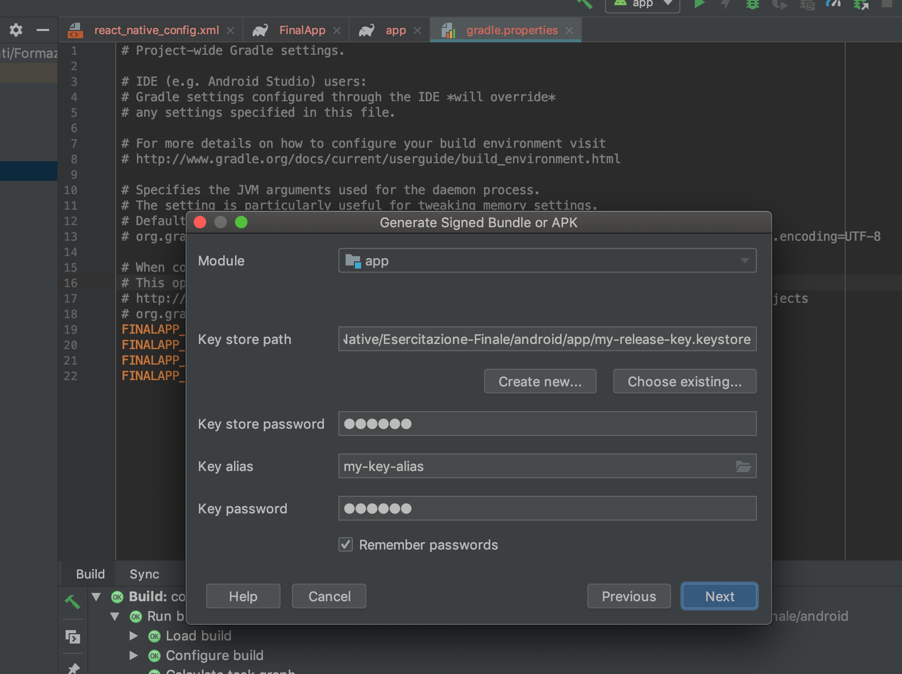
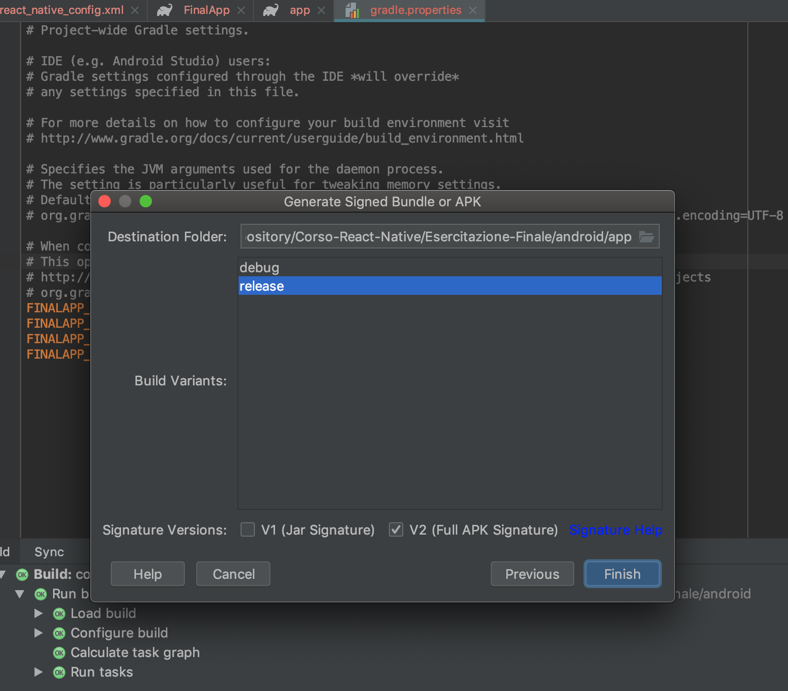

# Android APK
* sudo keytool -genkey -v -keystore my-release-key.keystore -alias my-key-alias -keyalg RSA -keysize 2048 -validity 10000
* Place the my-release-key.keystore file under the android/app directory in your project folder.
* Create offline js bundle;
* Create folder assets: android/app/src/main/assets;
* Run:<br/>
```react-native bundle --platform android --dev false --entry-file index.js --bundle-output android/app/src/main/assets/index.android.bundle --assets-dest android/app/src/main/res/```

> Modificare il build.gradle all interno della cartella app di android:
```
    signingConfigs {
        release {
             if (project.hasProperty('MYAPP_RELEASE_STORE_FILE')) {
            storeFile file(MYAPP_RELEASE_STORE_FILE)
            storePassword MYAPP_RELEASE_STORE_PASSWORD
            keyAlias MYAPP_RELEASE_KEY_ALIAS
            keyPassword MYAPP_RELEASE_KEY_PASSWORD
             }
        }
    }
    buildTypes {
        release {
            ...
            signingConfig signingConfigs.release
        }
    }

```
* cd android && ./gradlew assembleRelease
* react-native run-android --variant=release

# Con Android studio
* Sequena Immagini: <br />





# iOS

* Run:<br/>react-native bundle --entry-file index.js --platform ios --dev false --bundle-output ios/main.jsbundle --assets-dest ios
* Modificare l AppDelegate.m:jsCodeLocation = [[NSBundle mainBundle] URLForResource:@"main" withExtension:@"jsbundle"];
